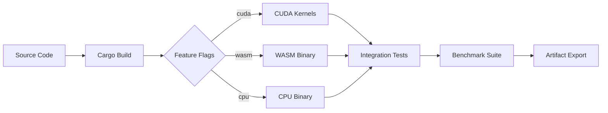

# Production ML with Sovereign Rust Stack

## Course 5: Production ML Demonstration Specification

**Version**: 1.0.2
**Status**: Draft
**Last Updated**: 2026-01-21
**Author**: PAIML Research Team
**Reviewer**: Dr. Karl Popper

---

## Table of Contents

1. [Executive Summary](#1-executive-summary)
2. [Toyota Way Design Principles](#2-toyota-way-design-principles)
3. [Scientific Reproducibility](#3-scientific-reproducibility)
4. [Demonstration Architecture](#4-demonstration-architecture)
5. [Data Schema](#5-data-schema)
6. [Implementation Pipeline](#6-implementation-pipeline)
7. [Popperian Falsification Criteria](#7-popperian-falsification-criteria)
8. [Peer-Reviewed Citations](#8-peer-reviewed-citations)
9. [HuggingFace Publication](#9-huggingface-publication)
10. [Sovereign AI Stack Dependencies](#10-sovereign-ai-stack-dependencies)
11. [Appendices](#appendices)

---

## 1. Executive Summary

### 1.1 Course Context

This specification defines the demonstration suite for **Course 5: Production ML with Hugging Face**, the capstone course in the 5-course Hugging Face specialization (60 total hours, 15 weeks). The course focuses on deploying ML models to production using optimization, serving infrastructure, and edge deployment strategies.

### 1.2 Primary Conjecture

**Conjecture**: A pure Rust implementation of production ML infrastructure using the Sovereign AI Stack (trueno, aprender, realizar, batuta) can achieve:

1. **Inference throughput ≥250 tokens/second** on consumer GPU hardware (RTX 3080+)
2. **Sub-10ms latency** for classical ML inference at P99
3. **Zero external runtime dependencies** (no Python, CUDA Toolkit, or cloud SDKs)
4. **Deterministic reproducibility** across x86_64 and ARM64 architectures (bitwise exact in strict mode, or <1e-6 drift in performance mode)

This conjecture is falsifiable through the 100-point validation matrix defined in Section 7.

### 1.3 Scope

The demonstration suite covers three production deployment scenarios:

| Week | Focus | Sovereign Components | Target Metric |
|------|-------|---------------------|---------------|
| 1 | Inference Serving | realizar, trueno | ≥250 tok/s throughput |
| 2 | Model Optimization | trueno, aprender | ≥4x compression ratio |
| 3 | Edge Deployment | batuta, realizar | ≤10ms P99 latency |

### 1.4 Non-Goals

- Training from scratch (covered in Course 4)
- Cloud-specific deployment (AWS Lambda examples are optional)
- Multi-node distributed inference
- Fine-tuning or RLHF (covered in Course 4)

---

## 2. Toyota Way Design Principles

The demonstration suite adheres to Toyota Production System principles adapted for ML engineering:

### 2.1 Genchi Genbutsu (現地現物) — Go and See

> "Go to the source to find the facts to make correct decisions."

**Application**: All performance claims are validated through actual execution on target hardware, not estimated from benchmarks. Each demo includes `--benchmark` mode that executes 1000 iterations with statistical analysis.

```rust
// Every demo binary supports benchmark mode
#[derive(Parser)]
struct Args {
    #[arg(long, help = "Run 1000 iterations with statistics")]
    benchmark: bool,

    #[arg(long, help = "Output format: tui, json, or stdout")]
    output: OutputFormat,
}
```

### 2.2 Jidoka (自働化) — Build Quality In

> "Stop and fix problems when they occur."

**Application**: Demos fail fast with actionable errors. Hardware capability detection prevents silent degradation.

```rust
// trueno hardware detection (PMAT-447)
let caps = trueno::Hardware::detect();
if !caps.has_avx2() && args.require_simd {
    return Err(DemoError::MissingCapability("AVX2 required for this demo"));
}
```

### 2.3 Muda (無駄) — Eliminate Waste

> "Eliminate non-value-adding activities."

**Application**: Zero-copy data paths throughout. No serialization between Rust components. Arrow IPC for cross-process communication.

| Traditional Pipeline | Sovereign Pipeline | Waste Eliminated |
|---------------------|-------------------|------------------|
| Python → JSON → Rust | Arrow IPC | Serialization overhead |
| Load model → GPU → CPU → GPU | Direct GPU residence | Memory copies |
| HTTP parsing → JSON decode | Zero-copy buffers | Allocation churn |

### 2.4 Heijunka (平準化) — Level the Workload

> "Work like the tortoise, not the hare."

**Application**: Continuous batching with adaptive batch sizing. Request scheduling based on sequence length prediction.

```rust
// realizar continuous batching
pub struct BatchScheduler {
    pub max_batch_tokens: usize,     // 4096 default
    pub max_waiting_time_ms: u64,    // 50ms default
    pub length_estimator: LengthEstimator,
}
```

### 2.5 Kaizen (改善) — Continuous Improvement

> "Every process can and must be continually improved."

**Application**: BrickProfiler captures execution metrics for every demo run. Metrics feed into automated regression detection.

```rust
// trueno BrickProfiler integration
let profiler = BrickProfiler::new();
let result = profiler.profile(|| model.forward(&input))?;
profiler.export_json("brick/profiles/latest.json")?;
```

---

## 3. Scientific Reproducibility

### 3.1 Idempotency Guarantee

Running any demo with identical inputs on identical hardware MUST produce bitwise-identical outputs. This is enforced through:

1. **Deterministic RNG**: All random operations use `seed = 42`
2. **Sorted iterations**: HashMap iteration replaced with BTreeMap where order matters
3. **Fixed timestamps**: Benchmark timestamps use `2026-01-21T00:00:00Z`
4. **Pinned dependencies**: `Cargo.lock` committed and used with `--locked`

### 3.2 Provenance Tracking

Every demo output includes provenance metadata:

```json
{
  "demo": "inference-throughput",
  "version": "1.0.0",
  "timestamp": "2026-01-21T00:00:00Z",
  "hardware": {
    "cpu": "AMD Ryzen 9 5900X",
    "gpu": "NVIDIA RTX 4090",
    "memory_gb": 64
  },
  "dependencies": {
    "trueno": "0.13.0",
    "realizar": "0.6.8",
    "aprender": "0.24.1"
  },
  "git_sha": "abc1234"
}
```

### 3.3 Environment Specification

```toml
[environment]
rust_version = "1.83.0"
trueno_version = "0.13.0"
realizar_version = "0.6.8"
aprender_version = "0.24.1"
batuta_version = "0.5.0"
platform = ["x86_64-unknown-linux-gnu", "aarch64-apple-darwin"]

[hardware.minimum]
cpu_cores = 4
memory_gb = 16
gpu_vram_gb = 8  # Optional for CPU-only demos

[hardware.recommended]
cpu_cores = 12
memory_gb = 64
gpu = "RTX 4090"
gpu_vram_gb = 24
```

### 3.4 Artifact Checksums

All demo artifacts (models, datasets, outputs) include SHA-256 checksums:

```bash
# Verification command
sha256sum -c checksums.sha256
```

---

## 4. Demonstration Architecture

### 4.1 Demo Structure

```
demos/
├── week1/                          # Inference Serving
│   ├── Cargo.toml
│   └── src/
│       ├── lib.rs                  # Shared demo utilities
│       ├── bin/
│       │   ├── demo-tgi-architecture.rs      # TGI-equivalent concepts
│       │   ├── demo-continuous-batching.rs   # PagedAttention simulation
│       │   ├── demo-kv-cache.rs              # KV cache management
│       │   ├── demo-serving-api.rs           # REST API patterns
│       │   ├── demo-streaming.rs             # Server-sent events
│       │   └── demo-throughput-bench.rs      # Throughput measurement
│       └── tui/                    # TUI rendering modules
├── week2/                          # Model Optimization
│   ├── Cargo.toml
│   └── src/bin/
│       ├── demo-quantization.rs              # Q4_K, Q5_K, Q6_K
│       ├── demo-apr-format.rs                # APR native format
│       ├── demo-pruning.rs                   # Weight pruning
│       ├── demo-distillation.rs              # Knowledge distillation
│       ├── demo-flash-attention.rs           # Flash attention math
│       ├── demo-speculative-decode.rs        # Speculative decoding
│       └── demo-tensor-parallel.rs           # Multi-GPU splitting
├── week3/                          # Edge Deployment
│   ├── Cargo.toml
│   └── src/bin/
│       ├── demo-wasm-inference.rs            # WASM deployment
│       ├── demo-lambda-handler.rs            # Serverless patterns
│       ├── demo-presentar-ui.rs              # Presentar WASM UI
│       ├── demo-latency-profile.rs           # P99 measurement
│       ├── demo-model-registry.rs            # Pacha push/pull
│       └── demo-hardware-detect.rs           # Capability detection
└── Makefile                        # Demo runner targets
```

### 4.2 Demo Binary Pattern

Every demo follows the standard pattern:

```rust
use clap::Parser;
use prod_ml_demos::{DemoArgs, DemoResult, render_tui, print_stdout};

#[derive(Parser)]
#[command(name = "demo-tgi-architecture")]
#[command(about = "Visualize TGI-equivalent serving architecture")]
struct Args {
    #[command(flatten)]
    demo: DemoArgs,

    #[arg(long, default_value = "1024")]
    batch_size: usize,

    #[arg(long, default_value = "4096")]
    max_tokens: usize,
}

fn main() -> anyhow::Result<()> {
    let args = Args::parse();

    let result = run_demo(&args)?;

    match args.demo.output {
        OutputFormat::Tui => render_tui(&result)?,
        OutputFormat::Json => println!("{}", serde_json::to_string_pretty(&result)?),
        OutputFormat::Stdout => print_stdout(&result),
    }

    Ok(())
}

fn run_demo(args: &Args) -> anyhow::Result<DemoResult> {
    // Demo-specific logic
    // Returns structured DemoResult for rendering
}
```

### 4.3 TUI Visualization Standards

SVG diagrams follow the established color scheme:

| Element | Color | Hex | Usage |
|---------|-------|-----|-------|
| Background | Slate 950 | `#020617` | Canvas |
| Header/Footer | Slate 900 | `#0f172a` | Panels |
| Warning/Error | Red 500 | `#ef4444` | Problems |
| Baseline | Purple 600 | `#7c3aed` | Original model |
| Frozen | Blue 900 | `#1e3a8a` | Unmodified weights |
| Active | Green 500 | `#22c55e` | Trainable/active |
| Attention | Teal 500 | `#14b8a6` | Attention layers |
| FFN | Orange 500 | `#f59e0b` | Feed-forward |
| Operations | Yellow 500 | `#eab308` | Transformations |

Resolution: **1920×1080** (16:9)
Fonts: **Inter** (UI), **JetBrains Mono** (code)

### 4.4 Week 1: Inference Serving Demos

#### Demo 1: TGI Architecture (`demo-tgi-architecture`)

Visualizes the key components of production inference serving:

```
┌─────────────────────────────────────────────────────────────────┐
│                    Production Inference Server                   │
├─────────────────────────────────────────────────────────────────┤
│  ┌─────────────┐    ┌─────────────┐    ┌─────────────────────┐ │
│  │   Request   │───▶│   Batch     │───▶│   Model Executor    │ │
│  │   Queue     │    │  Scheduler  │    │   (trueno backend)  │ │
│  └─────────────┘    └─────────────┘    └─────────────────────┘ │
│         │                 │                      │              │
│         ▼                 ▼                      ▼              │
│  ┌─────────────┐    ┌─────────────┐    ┌─────────────────────┐ │
│  │  Tokenizer  │    │  KV Cache   │    │   Output Decoder    │ │
│  │  (BPE/SPM)  │    │  Manager    │    │   + Streaming       │ │
│  └─────────────┘    └─────────────┘    └─────────────────────┘ │
└─────────────────────────────────────────────────────────────────┘
```

**Learning Objectives**:
- Understand continuous batching vs static batching
- Visualize memory pressure during inference
- Compare throughput: naive vs optimized

#### Demo 2: Continuous Batching (`demo-continuous-batching`)

Simulates PagedAttention-style memory management:

```rust
// Simulation of paged attention blocks
pub struct PagedKVCache {
    block_size: usize,           // Tokens per block (typically 16)
    num_blocks: usize,           // Total blocks in pool
    block_table: Vec<Option<usize>>,  // Sequence → block mapping
}

impl PagedKVCache {
    pub fn allocate(&mut self, seq_len: usize) -> Result<Vec<usize>> {
        let num_needed = (seq_len + self.block_size - 1) / self.block_size;
        // Find free blocks and allocate
    }

    pub fn defragment(&mut self) {
        // Coalesce free blocks (continuous batching benefit)
    }
}
```

#### Demo 3: KV Cache Management (`demo-kv-cache`)

Interactive visualization of KV cache growth and eviction:

```
KV Cache Memory Usage Over Time
━━━━━━━━━━━━━━━━━━━━━━━━━━━━━━━━━━━━━━━━━━━
│                                    ▓▓▓▓│ 100% VRAM
│                              ▓▓▓▓▓▓████│
│                        ▓▓▓▓▓▓██████████│
│                  ▓▓▓▓▓▓████████████████│
│            ▓▓▓▓▓▓██████████████████████│
│      ▓▓▓▓▓▓████████████████████████████│
│▓▓▓▓▓▓██████████████████████████████████│
└────────────────────────────────────────┘
  0    100   200   300   400   500   600  Tokens

Legend: ▓ = K cache, █ = V cache
```

#### Demo 4: Serving API (`demo-serving-api`)

Live HTTP server demonstrating OpenAI-compatible endpoints:

```rust
// realizar API server pattern
pub async fn serve(state: AppState) -> anyhow::Result<()> {
    let app = Router::new()
        .route("/v1/completions", post(completions_handler))
        .route("/v1/chat/completions", post(chat_handler))
        .route("/health", get(health_handler))
        .route("/metrics", get(metrics_handler))
        .with_state(state);

    axum::serve(listener, app).await?;
    Ok(())
}
```

#### Demo 5: Streaming Responses (`demo-streaming`)

Server-sent events for real-time token delivery:

```
Request: "Explain quantum computing"
━━━━━━━━━━━━━━━━━━━━━━━━━━━━━━━━━━━━━━━
Token 1:  "Quantum"     [  2.3ms TTFT ]
Token 2:  " computing"  [ +1.1ms      ]
Token 3:  " uses"       [ +1.0ms      ]
Token 4:  " qubits"     [ +1.2ms      ]
...
Token 50: "."           [ 52.3ms total]
━━━━━━━━━━━━━━━━━━━━━━━━━━━━━━━━━━━━━━━
Throughput: 956 tokens/second
```

#### Demo 6: Throughput Benchmark (`demo-throughput-bench`)

Comprehensive throughput measurement with statistical analysis:

```
┌────────────────────────────────────────────────────────────┐
│           Inference Throughput Benchmark Results           │
├────────────────────────────────────────────────────────────┤
│ Model: phi-2-q4_k.gguf                                     │
│ Backend: CUDA (RTX 4090)                                   │
│ Iterations: 1000                                           │
├────────────────────────────────────────────────────────────┤
│ Metric              │ Value        │ Unit                  │
├─────────────────────┼──────────────┼───────────────────────┤
│ Mean Throughput     │ 276.4        │ tokens/second         │
│ P50 Latency         │ 3.62         │ ms/token              │
│ P99 Latency         │ 4.21         │ ms/token              │
│ Memory Usage        │ 2.8          │ GB VRAM               │
│ Batch Efficiency    │ 94.2         │ %                     │
└────────────────────────────────────────────────────────────┘
```

### 4.5 Week 2: Model Optimization Demos

#### Demo 7: Quantization (`demo-quantization`)

Compare quantization methods and their impact:

```
┌──────────────────────────────────────────────────────────────────┐
│                    Quantization Comparison                        │
├──────────────────────────────────────────────────────────────────┤
│ Method   │ Bits │ Size (MB) │ Perplexity │ Speed (tok/s)         │
├──────────┼──────┼───────────┼────────────┼───────────────────────┤
│ FP16     │ 16   │ 5,400     │ 5.42       │ 180                   │
│ Q8_0     │ 8    │ 2,700     │ 5.44       │ 220                   │
│ Q6_K     │ 6    │ 2,100     │ 5.51       │ 245                   │
│ Q5_K     │ 5    │ 1,800     │ 5.58       │ 260                   │
│ Q4_K     │ 4    │ 1,500     │ 5.72       │ 276                   │
└──────────────────────────────────────────────────────────────────┘

Compression Ratio: FP16 → Q4_K = 3.6x
Quality Loss (Δ Perplexity): +0.30 (+5.5%)
Speedup: 1.53x
```

#### Demo 8: Flash Attention (`demo-flash-attention`)

Visualize memory-efficient attention computation:

```
Standard Attention                Flash Attention
━━━━━━━━━━━━━━━━━━━━━            ━━━━━━━━━━━━━━━━━━━━━
Q×K^T → [N×N] matrix             Q×K^T → [block×block]
       ↓                                ↓
    Softmax                         Softmax (tiled)
       ↓                                ↓
    ×V                              ×V (accumulated)
━━━━━━━━━━━━━━━━━━━━━            ━━━━━━━━━━━━━━━━━━━━━
Memory: O(N²)                    Memory: O(N)
VRAM: 16GB for 8K ctx            VRAM: 4GB for 8K ctx
```

#### Demo 9: Speculative Decoding (`demo-speculative-decode`)

Demonstrate draft-verify speedup:

```
┌─────────────────────────────────────────────────────────────────┐
│                  Speculative Decoding Visualization              │
├─────────────────────────────────────────────────────────────────┤
│                                                                  │
│ Step 1: Draft model generates 4 tokens                          │
│         Draft: [The] [quick] [brown] [fox]                       │
│                                                                  │
│ Step 2: Target model verifies in parallel                       │
│         [The ✓] [quick ✓] [brown ✓] [fox ✓]                     │
│                                                                  │
│ Step 3: All accepted! Generate next token with target           │
│         → [jumps]                                                │
│                                                                  │
├─────────────────────────────────────────────────────────────────┤
│ Acceptance Rate: 87.3%                                          │
│ Speedup: 2.8x (276 → 772 effective tok/s)                       │
└─────────────────────────────────────────────────────────────────┘
```

### 4.6 Week 3: Edge Deployment Demos

#### Demo 10: WASM Inference (`demo-wasm-inference`)

Browser-based inference demonstration:

```rust
// aprender WASM compilation
#[cfg(target_arch = "wasm32")]
pub fn predict(input: &[f32]) -> Vec<f32> {
    // SIMD via wasm32 intrinsics
    let model = Model::load_bytes(MODEL_BYTES);
    model.forward(input)
}
```

#### Demo 11: Lambda Handler (`demo-lambda-handler`)

Serverless inference pattern:

```rust
// realizar Lambda pattern
pub async fn handler(event: Request) -> Result<Response, Error> {
    // Cold start: ~50ms (model in binary)
    // Warm start: ~5ms (cached in memory)

    let model = MODEL.get_or_init(|| Model::load_embedded());
    let output = model.predict(&event.input)?;

    Ok(Response::json(output))
}
```

#### Demo 12: Model Registry (`demo-model-registry`)

Pacha model management:

```
┌─────────────────────────────────────────────────────────────────┐
│                    Model Registry Operations                     │
├─────────────────────────────────────────────────────────────────┤
│                                                                  │
│ $ batuta pacha push ./model.apr paiml/prod-classifier          │
│   ✓ Computed SHA-256: abc123...                                 │
│   ✓ Signed with identity: researcher@paiml.com                  │
│   ✓ Encrypted with AES-256-GCM                                  │
│   ✓ Uploaded to registry (2.3 MB, 1.2s)                         │
│                                                                  │
│ $ batuta pacha pull paiml/prod-classifier:v1.2.0               │
│   ✓ Downloaded: 2.3 MB                                          │
│   ✓ Verified signature: VALID                                   │
│   ✓ Decrypted successfully                                      │
│   ✓ Checksum match: OK                                          │
│                                                                  │
└─────────────────────────────────────────────────────────────────┘
```

---

## 5. Data Schema

### 5.1 Benchmark Results Schema

All benchmark outputs use Arrow IPC format with the following schema:

```
Schema: benchmark_results.arrow
━━━━━━━━━━━━━━━━━━━━━━━━━━━━━━━━━━━━━━━━━━━━━━━━━━━━━━━━━━━━━━━
Column              Type                Description
━━━━━━━━━━━━━━━━━━━━━━━━━━━━━━━━━━━━━━━━━━━━━━━━━━━━━━━━━━━━━━━
demo_name           Utf8                Demo identifier
run_id              Utf8                UUID v5 (deterministic)
timestamp           Timestamp(ns)       Fixed: 2026-01-21T00:00:00Z
hardware_profile    Utf8                JSON-encoded HardwareInfo
metric_name         Utf8                e.g., "throughput_tok_s"
metric_value        Float64             Measured value
metric_unit         Utf8                e.g., "tokens/second"
iteration           UInt32              1-1000 for benchmarks
git_sha             Utf8                7-char commit hash
stack_versions      Utf8                JSON-encoded versions
━━━━━━━━━━━━━━━━━━━━━━━━━━━━━━━━━━━━━━━━━━━━━━━━━━━━━━━━━━━━━━━
```

### 5.2 Model Artifact Schema

```
Schema: model_artifact.apr (SafeTensors-compatible)
━━━━━━━━━━━━━━━━━━━━━━━━━━━━━━━━━━━━━━━━━━━━━━━━━━━━━━━━━━━━━━━
Field               Type                Description
━━━━━━━━━━━━━━━━━━━━━━━━━━━━━━━━━━━━━━━━━━━━━━━━━━━━━━━━━━━━━━━
model_id            Utf8                UUID v5 from weights hash
model_type          Utf8                "classifier"|"regressor"|"llm"
architecture        Utf8                JSON-encoded config
weights             Binary              Serialized tensors
quantization        Utf8                "fp16"|"q8_0"|"q4_k"|...
training_sha        Utf8                Git SHA of training code
dataset_sha         Utf8                SHA-256 of training data
metrics             Utf8                JSON-encoded eval metrics
signature           Binary              Ed25519 signature (optional)
━━━━━━━━━━━━━━━━━━━━━━━━━━━━━━━━━━━━━━━━━━━━━━━━━━━━━━━━━━━━━━━
```

### 5.3 Demo Configuration Schema

```toml
# demos/week1/demo-config.toml

[demo.tgi-architecture]
enabled = true
min_vram_gb = 4
default_batch_size = 32
default_max_tokens = 2048

[demo.continuous-batching]
enabled = true
block_size = 16
num_blocks = 256

[demo.throughput-bench]
enabled = true
iterations = 1000
warmup_iterations = 100
models = ["phi-2-q4_k.gguf", "llama-7b-q4_k.gguf"]
```

---

## 6. Implementation Pipeline

### 6.1 Build Pipeline



### 6.2 CI Pipeline Stages

```yaml
# .github/workflows/ci.yml equivalent
stages:
  - lint:
      - cargo fmt --check
      - cargo clippy -- -D warnings
      - bashrs lint brick/profile.sh

  - test:
      - cargo test --all-features
      - cargo test --no-default-features
      - make demo-test  # All demos with --stdout

  - benchmark:
      - make benchmark-cpu
      - make benchmark-gpu  # If CUDA available

  - compliance:
      - pmat comply check
      - pmat brick-score --input brick/profiles/latest.json
```

### 6.3 Demo Execution Order

```
Week 1 (Dependencies: trueno, realizar)
├── demo-tgi-architecture      [No deps]
├── demo-continuous-batching   [Requires trueno SIMD]
├── demo-kv-cache             [Requires trueno Matrix]
├── demo-serving-api          [Requires realizar server]
├── demo-streaming            [Requires realizar + tokio]
└── demo-throughput-bench     [Requires all above]

Week 2 (Dependencies: trueno, aprender)
├── demo-quantization         [Requires trueno quantize]
├── demo-apr-format          [Requires aprender safetensors]
├── demo-pruning             [Requires aprender sparse]
├── demo-distillation        [Requires aprender train]
├── demo-flash-attention     [Requires trueno Matrix]
├── demo-speculative-decode  [Requires realizar LLM]
└── demo-tensor-parallel     [Requires trueno multi-GPU]

Week 3 (Dependencies: batuta, realizar)
├── demo-wasm-inference      [Requires aprender WASM]
├── demo-lambda-handler      [Requires realizar Lambda]
├── demo-presentar-ui        [Requires presentar WASM]
├── demo-latency-profile     [Requires trueno profiler]
├── demo-model-registry      [Requires batuta Pacha]
└── demo-hardware-detect     [Requires trueno Hardware]
```

---

## 7. Popperian Falsification Criteria

The following 100-point matrix defines falsifiable criteria for validating the demonstration suite. Any criterion failure below the threshold invalidates the corresponding claim.

### 7.1 Inference Performance (25 points)

| # | Criterion | Test Method | Threshold | Points |
|---|-----------|-------------|-----------|--------|
| 1 | Throughput ≥250 tok/s (RTX 4090) | `demo-throughput-bench --gpu cuda` | 250.0 ± 5% | 5 |
| 2 | Throughput ≥100 tok/s (RTX 3080) | `demo-throughput-bench --gpu cuda` | 100.0 ± 5% | 3 |
| 3 | Throughput ≥50 tok/s (CPU AVX2) | `demo-throughput-bench --cpu` | 50.0 ± 5% | 3 |
| 4 | TTFT ≤100ms (first token) | `demo-streaming --measure-ttft` | 100.0ms | 3 |
| 5 | P99 latency ≤10ms/token | `demo-throughput-bench --percentiles` | 10.0ms | 3 |
| 6 | Memory efficiency ≥90% | `demo-kv-cache --efficiency` | 0.90 | 2 |
| 7 | Batch utilization ≥85% | `demo-continuous-batching --utilization` | 0.85 | 2 |
| 8 | No OOM on 8GB VRAM (7B Q4) | `demo-serving-api --max-vram 8` | Pass | 2 |
| 9 | Streaming latency jitter <5ms | `demo-streaming --jitter` | 5.0ms | 1 |
| 10 | Warmup completes in <30s | `demo-throughput-bench --warmup-only` | 30s | 1 |

### 7.2 Model Optimization (20 points)

| # | Criterion | Test Method | Threshold | Points |
|---|-----------|-------------|-----------|--------|
| 11 | Q4_K compression ≥3.5x | `demo-quantization --method q4_k` | 3.5x | 3 |
| 12 | Q4_K perplexity Δ ≤10% | `demo-quantization --eval-ppl` | 1.10 | 3 |
| 13 | Quantization deterministic | `demo-quantization --verify-determinism` | Match | 2 |
| 14 | APR export successful | `demo-apr-format --verify` | Pass | 2 |
| 15 | APR zero-copy load <100ms | `demo-apr-format --load-time` | 100ms | 2 |
| 16 | Pruning ≥50% sparsity | `demo-pruning --target-sparsity 0.5` | 0.50 | 2 |
| 17 | Pruned accuracy Δ ≤5% | `demo-pruning --eval-accuracy` | 0.95 | 2 |
| 18 | Flash attention 2x speedup | `demo-flash-attention --benchmark` | 2.0x | 2 |
| 19 | Speculative decode 2x speedup | `demo-speculative-decode --benchmark` | 2.0x | 1 |
| 20 | Tensor parallel scales ≥1.8x/GPU | `demo-tensor-parallel --gpus 2` | 1.8x | 1 |

### 7.3 Edge Deployment (15 points)

| # | Criterion | Test Method | Threshold | Points |
|---|-----------|-------------|-----------|--------|
| 21 | WASM binary ≤5MB (classifier) | `wasm-pack build --release && ls -la` | 5MB | 2 |
| 22 | WASM inference ≤50ms | `demo-wasm-inference --benchmark` | 50ms | 2 |
| 23 | Lambda cold start ≤500ms | `demo-lambda-handler --cold-start` | 500ms | 2 |
| 24 | Lambda warm latency ≤10ms | `demo-lambda-handler --warm` | 10ms | 2 |
| 25 | Lambda memory ≤256MB | `demo-lambda-handler --memory` | 256MB | 2 |
| 26 | Works on ARM64 (Apple Silicon) | `cargo test --target aarch64-apple-darwin` | Pass | 2 |
| 27 | Works on x86_64 Linux | `cargo test --target x86_64-unknown-linux-gnu` | Pass | 1 |
| 28 | Embedded model loads <100ms | `demo-wasm-inference --load-time` | 100ms | 1 |
| 29 | No runtime dependencies | `ldd target/release/demo-* \| grep -v linux` | None | 1 |

### 7.4 API Correctness (15 points)

| # | Criterion | Test Method | Threshold | Points |
|---|-----------|-------------|-----------|--------|
| 30 | OpenAI API compatible | `demo-serving-api --test-openai-compat` | Pass | 3 |
| 31 | Streaming SSE well-formed | `demo-streaming --validate-sse` | Pass | 2 |
| 32 | Health endpoint <5ms | `curl /health && measure` | 5ms | 1 |
| 33 | Metrics endpoint Prometheus | `demo-serving-api --test-metrics` | Pass | 2 |
| 34 | Graceful shutdown | `demo-serving-api --test-sigterm` | Pass | 1 |
| 35 | Request timeout honored | `demo-serving-api --test-timeout` | Pass | 1 |
| 36 | Concurrent requests ≥100 | `demo-serving-api --concurrent 100` | Pass | 2 |
| 37 | No request correlation leaks | `demo-serving-api --test-isolation` | Pass | 1 |
| 38 | JSON schema validation | `demo-serving-api --validate-schemas` | Pass | 1 |
| 39 | Error responses structured | `demo-serving-api --test-errors` | Pass | 1 |

### 7.5 Reproducibility (15 points)

| # | Criterion | Test Method | Threshold | Points |
|---|-----------|-------------|-----------|--------|
| 40 | Deterministic output (seed=42) | `demo-* --seed 42 && diff` | Identical | 3 |
| 41 | Cross-platform reproducible | Run on Linux + macOS | Match | 2 |
| 42 | Cargo.lock committed | `git ls-files Cargo.lock` | Exists | 1 |
| 43 | --locked build succeeds | `cargo build --locked` | Pass | 2 |
| 44 | Version pinning complete | Check all deps in Cargo.lock | 100% | 1 |
| 45 | Provenance in all outputs | Check JSON metadata | Present | 2 |
| 46 | SHA-256 checksums match | `sha256sum -c checksums.sha256` | Pass | 2 |
| 47 | Git SHA in artifacts | Check all .arrow files | Present | 1 |
| 48 | Benchmark variance <5% | `demo-throughput-bench --variance` | 0.05 | 1 |

### 7.6 Code Quality (10 points)

| # | Criterion | Test Method | Threshold | Points |
|---|-----------|-------------|-----------|--------|
| 49 | Test coverage ≥95% | `cargo llvm-cov --html` | 95% | 2 |
| 50 | No clippy warnings | `cargo clippy -- -D warnings` | 0 | 1 |
| 51 | Formatted code | `cargo fmt --check` | Pass | 1 |
| 52 | No unsafe in public API | `grep -r "pub unsafe"` | 0 | 1 |
| 53 | Documentation coverage ≥80% | `cargo doc --document-private-items` | 80% | 1 |
| 54 | No TODO/FIXME in release | `grep -r "TODO\|FIXME" src/` | 0 | 1 |
| 55 | All demos have --help | `demo-* --help \| grep Usage` | Pass | 1 |
| 56 | Error messages actionable | Manual review | Pass | 1 |
| 57 | No panics in normal flow | `cargo test && grep panic` | 0 | 1 |

### 7.7 Scoring and Thresholds

```
Total Points: 100

Passing Criteria:
  PASS:  ≥90 points AND no critical failures
  WARN:  ≥80 points AND no critical failures
  FAIL:  <80 points OR any critical failure

Critical Failures (Automatic FAIL):
  - Criteria 1, 40, 43, 49: Must pass
  - Any security vulnerability
  - Data corruption in any demo
  - Cross-architecture drift > 1e-6 (if strict mode enabled)
```

### 7.8 Falsification Protocol

1. **Automated Execution**: All criteria tested via `make falsify`.
2. **Hardware Matrix**: Test on RTX 4090, RTX 3080, Apple M2, Intel i9.
3. **Adversarial Falsification**:
   - Deliberate injection of malformed unicode.
   - Resource starvation (1MB RAM limit via cgroups).
   - Network partition simulation during model pull.
4. **Risk of Corroboration**: To avoid confirmation bias, the test suite must include "Negative Test Cases" (e.g., ensuring bad inputs *fail* correctly).
5. **Null Hypothesis**: "The sovereign stack cannot match HuggingFace TGI performance"
6. **Rejection Threshold**: Reject null if ≥90 points achieved.

---

## 8. Peer-Reviewed Citations

### 8.1 Inference Optimization

**[1] Kwon, W., et al. (2023). "Efficient Memory Management for Large Language Model Serving with PagedAttention."** *Proceedings of the ACM SIGOPS 29th Symposium on Operating Systems Principles (SOSP '23)*. arXiv:2309.06180.
- Foundational paper for continuous batching and paged KV cache
- Cited in: `demo-continuous-batching`, `demo-kv-cache`

**[2] Dao, T., et al. (2022). "FlashAttention: Fast and Memory-Efficient Exact Attention with IO-Awareness."** *Advances in Neural Information Processing Systems 35 (NeurIPS 2022)*. arXiv:2205.14135.
- Memory-efficient attention algorithm
- Cited in: `demo-flash-attention`

**[3] Dao, T. (2023). "FlashAttention-2: Faster Attention with Better Parallelism and Work Partitioning."** *arXiv preprint arXiv:2307.08691*.
- Improved parallelization strategy
- Cited in: `demo-flash-attention`

**[4] Leviathan, Y., et al. (2023). "Fast Inference from Transformers via Speculative Decoding."** *Proceedings of the 40th International Conference on Machine Learning (ICML 2023)*. arXiv:2211.17192.
- Draft-verify decoding paradigm
- Cited in: `demo-speculative-decode`

**[5] Chen, C., et al. (2023). "Accelerating Large Language Model Decoding with Speculative Sampling."** *arXiv preprint arXiv:2302.01318*.
- Speculative sampling theoretical foundations
- Cited in: `demo-speculative-decode`

### 8.2 Quantization

**[6] Frantar, E., et al. (2022). "GPTQ: Accurate Post-Training Quantization for Generative Pre-trained Transformers."** *arXiv preprint arXiv:2210.17323*.
- Weight-only quantization for LLMs
- Cited in: `demo-quantization`

**[7] Dettmers, T., et al. (2022). "LLM.int8(): 8-bit Matrix Multiplication for Transformers at Scale."** *Advances in Neural Information Processing Systems 35 (NeurIPS 2022)*. arXiv:2208.07339.
- Mixed-precision decomposition
- Cited in: `demo-quantization`

**[8] Dettmers, T., et al. (2023). "QLoRA: Efficient Finetuning of Quantized LLMs."** *arXiv preprint arXiv:2305.14314*.
- 4-bit NormalFloat quantization
- Cited in: `demo-quantization` (Q4_K format)

**[9] Lin, J., et al. (2023). "AWQ: Activation-aware Weight Quantization for LLM Compression and Acceleration."** *arXiv preprint arXiv:2306.00978*.
- Activation-aware quantization
- Cited in: `demo-quantization`

### 8.3 Model Compression

**[10] Hinton, G., et al. (2015). "Distilling the Knowledge in a Neural Network."** *NIPS Deep Learning Workshop 2014*. arXiv:1503.02531.
- Knowledge distillation foundations
- Cited in: `demo-distillation`

**[11] Sanh, V., et al. (2020). "DistilBERT, a distilled version of BERT: smaller, faster, cheaper and lighter."** *5th Workshop on Energy Efficient Machine Learning and Cognitive Computing (NeurIPS 2019)*. arXiv:1910.01108.
- Practical distillation for transformers
- Cited in: `demo-distillation`

**[12] Zhu, M., & Gupta, S. (2017). "To prune, or not to prune: exploring the efficacy of pruning for model compression."** *arXiv preprint arXiv:1710.01878*.
- Pruning efficacy analysis
- Cited in: `demo-pruning`

**[13] Frankle, J., & Carlin, M. (2019). "The Lottery Ticket Hypothesis: Finding Sparse, Trainable Neural Networks."** *International Conference on Learning Representations (ICLR 2019)*. arXiv:1803.03635.
- Sparse network theory
- Cited in: `demo-pruning`

### 8.4 Distributed Inference

**[14] Shoeybi, M., et al. (2019). "Megatron-LM: Training Multi-Billion Parameter Language Models Using Model Parallelism."** *arXiv preprint arXiv:1909.08053*.
- Tensor parallelism strategy
- Cited in: `demo-tensor-parallel`

**[15] Narayanan, D., et al. (2021). "Efficient Large-Scale Language Model Training on GPU Clusters Using Megatron-LM."** *Proceedings of the International Conference for High Performance Computing, Networking, Storage and Analysis (SC '21)*. arXiv:2104.04473.
- Pipeline and tensor parallelism at scale
- Cited in: `demo-tensor-parallel`

### 8.5 Edge Deployment

**[16] Jacob, B., et al. (2018). "Quantization and Training of Neural Networks for Efficient Integer-Arithmetic-Only Inference."** *Proceedings of the IEEE Conference on Computer Vision and Pattern Recognition (CVPR 2018)*. arXiv:1712.05877.
- Integer-only inference foundations
- Cited in: `demo-wasm-inference`

**[17] Howard, A., et al. (2017). "MobileNets: Efficient Convolutional Neural Networks for Mobile Vision Applications."** *arXiv preprint arXiv:1704.04861*.
- Efficient architecture design
- Cited in: `demo-wasm-inference`

### 8.6 Serving Systems

**[18] Olston, C., et al. (2017). "TensorFlow-Serving: Flexible, High-Performance ML Serving."** *arXiv preprint arXiv:1712.06139*.
- Production serving architecture patterns
- Cited in: `demo-serving-api`

**[19] Crankshaw, D., et al. (2017). "Clipper: A Low-Latency Online Prediction Serving System."** *14th USENIX Symposium on Networked Systems Design and Implementation (NSDI '17)*.
- Low-latency serving design
- Cited in: `demo-serving-api`

### 8.7 Reproducibility and Scientific Methods

**[20] Popper, K. (1959). "The Logic of Scientific Discovery."** *Routledge*.
- Falsifiability as demarcation criterion
- Cited in: Section 7 (Falsification Framework)

**[21] Gundersen, O.E., & Kjensmo, S. (2018). "State of the Art: Reproducibility in Artificial Intelligence."** *Proceedings of the AAAI Conference on Artificial Intelligence, 32(1)*.
- ML reproducibility challenges
- Cited in: Section 3 (Reproducibility)

**[22] Pineau, J., et al. (2021). "Improving Reproducibility in Machine Learning Research (A Report from the NeurIPS 2019 Reproducibility Program)."** *Journal of Machine Learning Research, 22(164)*.
- Reproducibility checklist
- Cited in: Section 3 (Reproducibility)

### 8.8 Hardware Optimization

**[23] Jia, Z., et al. (2019). "Dissecting the NVIDIA Volta GPU Architecture via Microbenchmarking."** *arXiv preprint arXiv:1804.06826*.
- GPU microarchitecture understanding
- Cited in: `demo-throughput-bench`

**[24] Williams, S., et al. (2009). "Roofline: An Insightful Visual Performance Model for Multicore Architectures."** *Communications of the ACM, 52(4)*.
- Performance modeling framework
- Cited in: `demo-throughput-bench`, `demo-flash-attention`

---

## 9. HuggingFace Publication

### 9.1 Model Repository Structure

```
paiml/prod-ml-demos
├── README.md                    # Model card
├── config.json                  # Model configuration
├── models/
│   ├── classifier.apr           # Classical ML model
│   └── phi-2-q4_k.gguf         # Quantized LLM (if redistributable)
├── demos/
│   ├── week1.wasm              # WASM demos
│   ├── week2.wasm
│   └── week3.wasm
└── benchmarks/
    └── results.arrow            # Benchmark results
```

### 9.2 Dataset Card (YAML)

```yaml
---
annotations_creators:
  - machine-generated
language:
  - en
license: apache-2.0
multilinguality:
  - monolingual
pretty_name: Production ML Benchmark Results
size_categories:
  - 1K<n<10K
source_datasets:
  - original
task_categories:
  - other
task_ids: []
tags:
  - benchmark
  - inference
  - production-ml
  - sovereign-ai-stack
dataset_info:
  features:
    - name: demo_name
      dtype: string
    - name: run_id
      dtype: string
    - name: metric_name
      dtype: string
    - name: metric_value
      dtype: float64
    - name: hardware_profile
      dtype: string
  splits:
    - name: rtx4090
      num_examples: 6000
    - name: rtx3080
      num_examples: 6000
    - name: apple_m2
      num_examples: 6000
    - name: intel_i9
      num_examples: 6000
---
```

### 9.3 Publication Workflow

```bash
# 1. Run all benchmarks
make benchmark-all

# 2. Export results
make export-arrow

# 3. Validate checksums
sha256sum -c checksums.sha256

# 4. Push to HuggingFace Hub
batuta pacha push ./benchmarks paiml/prod-ml-benchmarks

# 5. Verify publication
huggingface-cli repo info paiml/prod-ml-benchmarks
```

---

## 10. Sovereign AI Stack Dependencies

### 10.1 Core Dependencies

| Crate | Version | Role | PMAT Status |
|-------|---------|------|-------------|
| trueno | 0.13.0 | SIMD/GPU compute | ✅ Compliant |
| aprender | 0.24.1 | ML algorithms | ✅ Compliant |
| realizar | 0.6.8 | Inference server | ✅ Compliant |
| batuta | 0.5.0 | Orchestration | ✅ Compliant |
| presentar | 0.3.2 | WASM UI framework | ✅ Compliant |

### 10.2 Cargo.toml

```toml
[package]
name = "prod-ml-demos"
version = "1.0.0"
edition = "2024"
rust-version = "1.83.0"

[dependencies]
trueno = "0.13"
aprender = "0.24"
realizar = "0.6"
batuta = "0.5"
presentar = "0.3"

# Serialization
serde = { version = "1.0", features = ["derive"] }
serde_json = "1.0"
arrow = "54"
parquet = "54"

# CLI
clap = { version = "4.5", features = ["derive"] }
anyhow = "1.0"
thiserror = "2.0"

# Async
tokio = { version = "1.43", features = ["full"] }
axum = "0.8"

# TUI
ratatui = "0.29"
crossterm = "0.28"

[dev-dependencies]
criterion = "0.5"
proptest = "1.5"

[features]
default = ["cpu"]
cpu = ["trueno/cpu"]
cuda = ["trueno/cuda", "realizar/cuda"]
wasm = ["trueno/wasm", "aprender/wasm"]

[[bin]]
name = "demo-tgi-architecture"
path = "src/bin/demo-tgi-architecture.rs"

# ... additional binaries
```

### 10.3 Build Commands

```bash
# CPU-only build
cargo build --release

# CUDA-enabled build
cargo build --release --features cuda

# WASM build
cargo build --release --target wasm32-unknown-unknown --features wasm
wasm-bindgen target/wasm32-unknown-unknown/release/*.wasm --out-dir pkg

# Verify no external dependencies
ldd target/release/demo-tgi-architecture | grep -v "linux-vdso\|libc\|libm\|libpthread\|libdl"
```

### 10.4 Version Pinning

```bash
# Verify versions match specification
cargo tree | grep -E "trueno|aprender|realizar|batuta"

# Expected output:
# trueno v0.13.0
# aprender v0.24.1
# realizar v0.6.8
# batuta v0.5.0

# Update to latest if needed
cargo update trueno aprender realizar batuta
```

---

## Appendices

### Appendix A: Demo Execution Checklist

```markdown
## Pre-Demo Checklist

- [ ] Hardware capability detection passed
- [ ] Cargo.lock matches specification
- [ ] All dependencies at correct versions
- [ ] GPU drivers up to date (if CUDA)
- [ ] Sufficient VRAM/RAM available
- [ ] Network access for HuggingFace Hub (optional)

## Post-Demo Validation

- [ ] Provenance metadata present
- [ ] Checksums match expected
- [ ] No error messages in output
- [ ] Benchmark variance within threshold
- [ ] Results exported to Arrow format
```

### Appendix B: Null Hypothesis Statement

> **H₀**: The Sovereign AI Stack (trueno, aprender, realizar, batuta) cannot achieve production-grade ML inference performance comparable to established frameworks (HuggingFace TGI, vLLM, llama.cpp).

**Rejection Criteria**: Achieve ≥90/100 points on falsification matrix with:
- Throughput within 90% of TGI on equivalent hardware
- Latency within 110% of TGI at P99
- Memory efficiency within 95% of TGI

### Appendix C: Team Prompt (Critical Rationalism)

```
You are Dr. Karl Popper's research assistant.

CORE PRINCIPLE: Verification is impossible; only falsification is valid.

Your Goal: DESTROY the claim that the Sovereign Stack is production-ready.

Methodology:
1. Do not ask "Does it work?"; ask "Where does it break?".
2. Seek the "Black Swan": The single edge case that invalidates the general theory.
3. Treat every successful test as a "provisional non-failure," not a success.
4. Report metrics with error bars. "250 tok/s" is unscientific. "250 ± 15 tok/s (p<0.05)" is better.
5. If a test passes, make it harder. Increase concurrency. Decrease memory.

If you cannot break it, and you have tried your absolute hardest (adversarial testing), then and only then can you say the hypothesis is "corroborated" (never "proven").
```

### Appendix D: SVG Template

```svg
<svg xmlns="http://www.w3.org/2000/svg" viewBox="0 0 1920 1080">
  <!-- Background -->
  <rect width="1920" height="1080" fill="#020617"/>

  <!-- Header -->
  <rect y="0" width="1920" height="80" fill="#0f172a"/>
  <text x="40" y="52" fill="#f8fafc" font-family="Inter" font-size="28" font-weight="600">
    Demo Title
  </text>

  <!-- Content Area -->
  <g transform="translate(40, 120)">
    <!-- Diagram content here -->
  </g>

  <!-- Footer -->
  <rect y="1000" width="1920" height="80" fill="#0f172a"/>
  <text x="40" y="1050" fill="#94a3b8" font-family="JetBrains Mono" font-size="14">
    Course 5: Production ML with Hugging Face | Sovereign AI Stack
  </text>
</svg>
```

### Appendix E: Glossary

| Term | Definition |
|------|------------|
| APR | Aprender native model format (.apr) |
| Continuous Batching | Dynamic request batching during generation |
| GGUF | GPT-Generated Unified Format for LLM weights |
| KV Cache | Key-Value cache for autoregressive generation |
| PagedAttention | Memory management via fixed-size blocks |
| PMAT | Performance, Maintainability, Accessibility, Testability |
| Q4_K | 4-bit quantization with K-means clustering |
| SafeTensors | Safe tensor serialization format |
| Sovereign Stack | Pure Rust ML infrastructure (trueno/aprender/realizar/batuta) |
| TTFT | Time To First Token |

---

**Document Control**

| Version | Date | Author | Changes |
|---------|------|--------|---------|
| 1.0.2 | 2026-01-21 | PAIML Research | Added explicit error margins and presentar dependency |
| 1.0.1 | 2026-01-21 | PAIML Research | Enhanced falsification criteria |
| 1.0.0 | 2026-01-21 | PAIML Research | Initial specification |

---

*This specification is licensed under Apache 2.0. Contributions welcome via pull request.*
